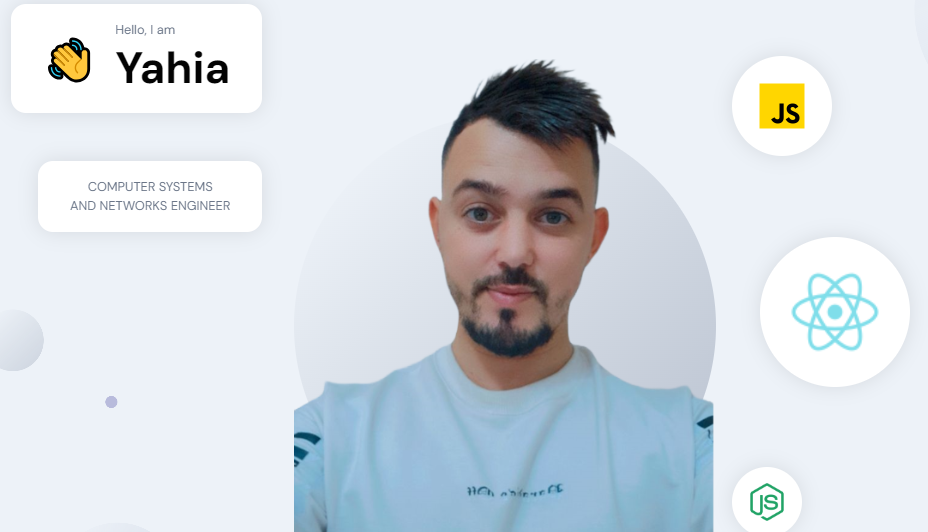

# Portfolio Website



## Description

This portfolio website showcases my work and projects. It is built using React, SCSS for styling, and utilizes Sanity CMS for backend data management. Framer Motion is used for animations to enhance user experience.

## Technologies Used

- React
- SCSS
- Sanity CMS
- Framer Motion

## Getting Started

Follow these steps to set up the project locally:

1. Clone the repository:
   git clone https://github.com/yayano/portfolio2024
2. Navigate to the project directory:
   cd portfolio2024
   cd frontend
3. Install dependencies:
   npm install
4. Set up Sanity CMS:

- Create a Sanity account and set up a new project.
- Configure your Sanity project and schemas according to your data requirements.

5. start the backend server:
   cd backend_sanity
   npm run dev

6. Set up environment variables:

- Create a `.env` file in the root directory.
- Add your Sanity project ID and dataset name to the `.env` file:
  ```
  VITE_SANITY_PROJECT_ID=your-sanity-project-id
  VITE_SANITY_DATASET=your-sanity-dataset-name
  ```

7. start the frontend react application:
   cd frontend
   npm run dev
8. Open your browser and visit http://localhost:3000 to view the website.

## Welcome!

Your local development environment is now set up and ready to go! Feel free to explore the portfolio website and familiarize yourself with its features and content.

If you have any questions, feedback, or suggestions, don't hesitate to reach out. I'm excited to share my work with you and look forward to hearing your thoughts!

Happy exploring!
